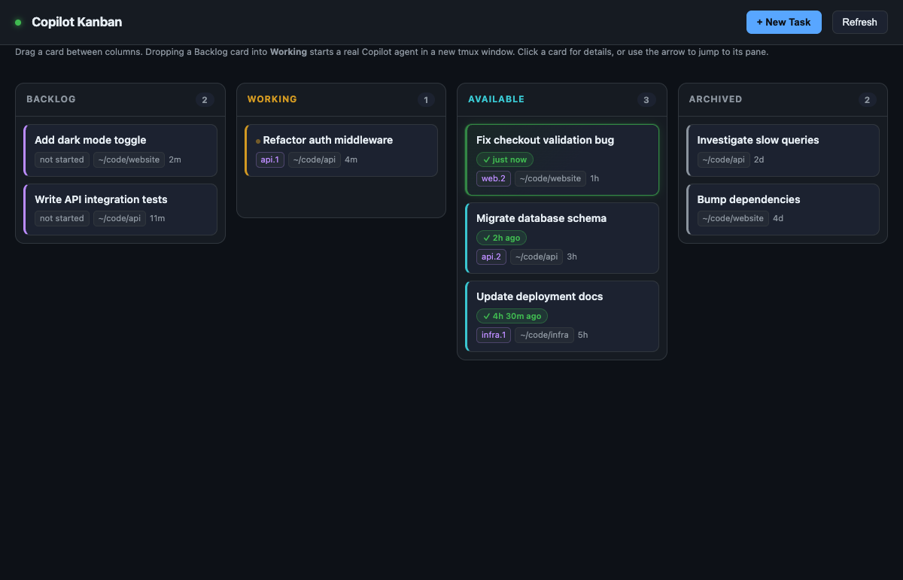

# copilot-kanban

A local Kanban board for your [GitHub Copilot CLI](https://docs.github.com/copilot/how-tos/use-copilot-agents/use-copilot-cli) sessions.

If you run several Copilot CLI agents side by side in tmux, you have probably
lost track of which one is still thinking, which one finished ten minutes ago,
and what you even asked the one in the bottom-right pane. This puts all of them
on one board in your browser.



> **macOS only, alpha quality.** Desktop notifications and "jump to this pane"
> rely on AppleScript. Everything else is portable in principle, but this is
> only tested on macOS.

## What it does

- **Every session as a card**, showing its task name, working directory, and
  which tmux pane it lives in.
- **Working vs. Available** — driven by real Copilot CLI lifecycle hooks, not by
  scraping terminal output.
- **Drag a card into Working** to start a new Copilot agent in a new tmux
  window. Your existing pane layout is never rearranged.
- **Assign a follow-up task** to any free session and it continues that same
  conversation, with its context intact.
- **Jump to a pane** without sending anything, from the arrow on the card.
- **Readable summaries** — the last agent reply is condensed to a sentence, with
  the full response rendered as HTML behind a toggle instead of raw markdown.
- **Recently finished sessions float to the top** and are highlighted for an hour.

## Before you install: what this tool can do to your machine

This is not a passive dashboard. Be sure you are comfortable with all of this:

- **It starts real agents.** Dragging a card to Working runs `copilot` in a new
  tmux window. By default it passes **`--yolo`**, which auto-approves every tool
  call — that agent can edit files and run shell commands without asking. A
  backgrounded agent that stops to ask permission would just block forever with
  nobody watching, which is why it is the default. Set
  `COPILOT_KANBAN_AUTO_APPROVE=0` to require approval in the pane instead.
- **It types into your terminals.** "Assign next task" uses `tmux send-keys` to
  type your text into a live pane and press Enter, exactly as if you had typed
  it. It refuses to do this while a session is busy, but it cannot verify what
  is actually focused in that pane.
- **The board itself never leaves your machine.** It binds `127.0.0.1` only, has
  no account, no telemetry, and makes no outbound network calls. Requests are
  rejected unless they carry a matching `Host`, a same-origin `Origin`, and a
  per-launch token embedded in the page, so other sites you visit cannot drive
  it. Note that the *agents it starts* are ordinary Copilot sessions and are not
  sandboxed by this tool.

## Requirements

| | |
|---|---|
| OS | macOS |
| Python | 3.8+ (standard library only — no `pip install`) |
| tmux | any recent version |
| Copilot CLI | installed, authenticated, with hooks support |

## Install

```bash
git clone https://github.com/wtgline/copilot-kanban.git
cd copilot-kanban
./install.sh
```

This symlinks `copilot-kanban` and `copilot-hook` into `~/.local/bin` and writes
a hook config to `~/.copilot/hooks/copilot-kanban.json`. If an unrelated file is
already at that path it is backed up first and restored on uninstall; a file the
installer did not create is never deleted.

Then:

```bash
copilot-kanban
```

It serves on <http://127.0.0.1:47900> and opens your browser.

> **Restart any Copilot sessions you already have open.** Copilot CLI reads hook
> configuration once at startup. Sessions that were already running will appear
> on the board but cannot report Working vs. Available until restarted — and
> because of that, the board may offer to send them a follow-up task while they
> are actually mid-turn. New sessions work immediately.

Install elsewhere with `./install.sh --prefix ~/bin`. To remove the commands and
the hook file, run `./install.sh --uninstall`; your Copilot session data and the
board's own state files are deliberately left in place.

## The columns

| Column | Meaning |
|---|---|
| **Backlog** | Tasks you have written down but not started |
| **Working** | An agent is actively running right now |
| **Available** | A live session sitting free, ready for new work |
| **Archived** | Past sessions with no live process |

There is deliberately no separate "Done" column. Every available session has
some previous output, so a permanent Done bucket just accumulates stale cards.
Recency lives on the card instead: a `✓ just now` / `✓ 2h 30m ago` badge, plus a
green highlight for anything finished within the last hour.

Cards in Working and Available reflect what is actually happening, so you cannot
drag a card into those columns by hand — only the agent can put itself there.
You can archive a free session, or restore one that is still running.

## Usage

**Start something new** — click **+ New Task**, give it a title, a prompt and a
working directory. It lands in Backlog. Drag it to **Working** and an agent
starts in a new tmux window.

**Continue something** — click any card in **Available**, type into *Assign next
task to this session*, and send. It goes into that session's existing
conversation rather than starting a fresh one.

**Look without touching** — hover a card and click **↗** to focus that tmux pane.
Nothing is typed or submitted.

## Configuration

| Variable | Default | Purpose |
|---|---|---|
| `COPILOT_KANBAN_PORT` | `47900` | Port to serve on |
| `COPILOT_KANBAN_TMUX` | auto-detected | tmux session to start new agents in |
| `COPILOT_KANBAN_AUTO_APPROVE` | `1` | `0` drops `--yolo` from dispatched agents |
| `COPILOT_KANBAN_NOTIFY` | `0` | `1` enables a desktop notification when an agent finishes (the board doesn't need it — this is cosmetic) |
| `COPILOT_KANBAN_TERMINALS` | common terminals | Comma-separated apps to raise when jumping |
| `COPILOT_HOME` | `~/.copilot` | Where Copilot CLI keeps its state |

Command line flags: `--port`, `--tmux`, `--no-open`, `--version`, `--help`.

The tmux session is auto-detected: the session you are attached to, else the one
already hosting Copilot panes, else the only session. If you run several and it
guesses wrong, set it explicitly with `--tmux`.

## How it works

The board never scrapes terminal output. It joins three sources:

1. **`~/.copilot/session-state/<uuid>/workspace.yaml`** — each session's task
   name, working directory and timestamps.
2. **`inuse.<pid>.lock`** — a live PID means the session is alive. The board
   walks the process tree against `tmux list-panes` to find which pane owns it,
   and treats a PID that isn't inside a known pane as dead, so a recycled PID
   can't resurrect an old card.
3. **Copilot CLI hooks** — `sessionStart`, `userPromptSubmitted` and `agentStop`
   write to `~/.copilot/board-status.json`, which is what distinguishes a busy
   session from a free one.

Dispatching a task pre-generates the session UUID and passes it to
`copilot --session-id`, so a card is bound to its session deterministically
rather than being matched up afterwards.

## Limitations

- macOS only.
- Requires tmux; no support for other multiplexers or bare terminals.
- Assigning a follow-up types into the pane, so the session must be free — you
  cannot interrupt a running turn from the board. Multi-line prompts are
  flattened to a single line before sending.
- Sessions started before the hooks were installed show up, but have no
  Working/Available signal until restarted.
- The board polls every two seconds rather than streaming.
- Archived shows the 15 most recent named sessions, not everything.
- There are no automated tests yet.

## Roadmap

- Phone / ntfy / Slack notifications on `agentStop`
- AI-generated one-line summaries instead of heuristic truncation
- Streaming updates instead of polling
- A test suite for the state-reconciliation logic
- Splitting the UI out of the Python file so it is easier to contribute to
- Linux support

## Contributing

Issues and pull requests are welcome. This started as a personal tool, so expect
sharp edges — bug reports including your macOS, tmux and Copilot CLI versions
are especially useful.

## License

[MIT](LICENSE)
